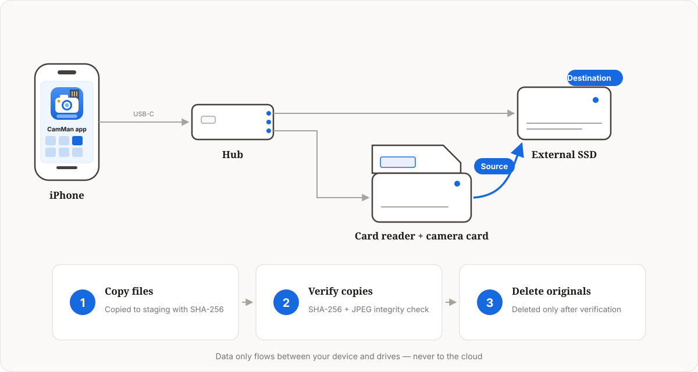

# Scenarios

Whether you are a photography enthusiast or a working professional, the first thing you do after a shoot is figure out how to offload the card, and the second is how to review what you just copied. In the past that meant carrying a laptop, buying a card-dumping hard drive, or packing stacks of spare cards — expensive, single-purpose solutions, some requiring dedicated hardware, none really designed around how shooters actually work.

I am a photographer myself, and this problem bothered me for years. So I built the CamMan app to solve it.

# How It Works

Connect external storage to your iPhone or iPad through a USB-C hub, then let CamMan handle reading and writing on that storage for card offloading and transfers.

Moving files from a camera card to an external drive is essentially "copy + verify + delete":

1. **Copy files**: files are copied in segments into a hidden staging area on the destination while a SHA-256 digest of the source is computed; a power-saving mode reduces heat and battery drain.
2. **Verify copies**: after copying, each staged file is read back and put through a triple check — byte count, SHA-256 digest against the source, plus a dedicated JPEG integrity scan that catches files truncated or left unfinished mid-transfer. Only when everything passes is the file atomically promoted out of staging and the result written to a persistent journal, ready for the deletion step.
3. **Delete originals**: source files on the card are deleted only after every copy has verified. When done, CamMan scans the card and lists any files that were not exported, so you can confirm before clearing it.

**Automatic retry on failures**: transient I/O errors during copy or verification (a USB-C hiccup, a flaky connector) trigger automatic retries with exponential backoff — roughly 1s, 2s, then 4s, up to 3 attempts, so concurrent files don't stampede the bus at once. Files that still fail, along with name conflicts, are listed in the result report, where you can start a retransfer right from the report page — files are re-copied from the card and re-verified against SHA-256 before replacing the destination copy.

Throughout the process, data only flows between your device and the drives — never through any cloud server.

# Batch Export

**What it does**

Batch export photos, RAW files, and video from camera cards to an external drive or USB stick. Queue multiple source cards to process them back to back, tune concurrency, enable power-saving mode, and get a result report when the export finishes — successes, failures, and name conflicts at a glance, and failed files can be retransferred right from the report page.

**How to use**

1. Use a USB-C hub to connect the camera card (via a card reader) and the external storage to your iPhone / iPad.
2. On the Export Media tab, pick the source and destination. To process several cards in a row, add them all to the source queue.
3. Adjust concurrency and power-saving mode as needed, then tap Start Export.
4. When the export finishes, review the result report: start a retransfer for failed files right from the report page, and compare name conflicts one by one to overwrite or skip.
5. To empty the camera card, open Clean Up Source from the report: mark any file you are unsure about for retransfer, then confirm to delete the rest — CamMan only deletes source files whose copies still verify.

# Browse Media

**What it does**

Browse photos and videos on external drives and camera cards in a built-in photo wall: a thumbnail grid for quick overviews, tap to view full screen, and swipe to flip through shots. Same-name JPG / RAW files are paired automatically — the wall shows JPGs by default and hides the paired RAWs, and one toggle switches to a RAW-first view, so the same shot never shows up twice while culling. Star ratings and EXIF inspection are supported, and a rating is written into both files of a pair — so Lightroom, Photo Mechanic, and other desktop tools can read them back.

**How to use**

1. On the Browse tab, select a connected storage device or folder.
2. In the photo wall, pinch to resize thumbnails and tap any shot to open it full screen.
3. Swipe left or right in full screen, tap the stars to rate, and view EXIF details such as capture time and aperture/shutter.
4. Toggle the JPG / RAW switch on the photo wall: JPGs show by default, and the RAW-first view hides the paired side automatically.
5. Filter by file type (photo / RAW / video) to quickly locate the shots you need.

# Share Media

**What it does**

Send media straight from external storage: import into the system Photos library organized by capture time, or share via AirDrop, WeChat, cloud drives, and any other share target. Photos and videos are sent at original quality with no compression or transcoding; RAW files are automatically converted to JPEG when sending, so recipients can view them without special software.

**How to use**

1. On the Browse tab, open the target folder and multi-select the photos or videos to send.
2. Tap the share button and choose Send to Photos; media is imported and grouped by capture time.
3. Or pick AirDrop, WeChat, a cloud drive, and more from the share sheet to send to other devices or contacts.

# Shooting References

**What it does**

Build a pocket library of shooting references: import images from Photos, Files, or a specified webpage, and organize them by tags for composition, lighting, color, location, and style. On location, filter by tag to pull up references and match your framing, or pair them with a storyboard to shoot shot by shot.

**How to use**

1. On the Shooting References tab, tap import to pick images from Photos or Files, or paste a webpage address to batch-fetch references.
2. Tag each reference (composition, lighting, color, location, style), or group them into destination collections by place.
3. On set, filter by tag or location, then enter shooting mode to match your framing and lighting against the reference.
4. For shot-by-shot execution, assign references to storyboard frames and check each one off as you finish it.
