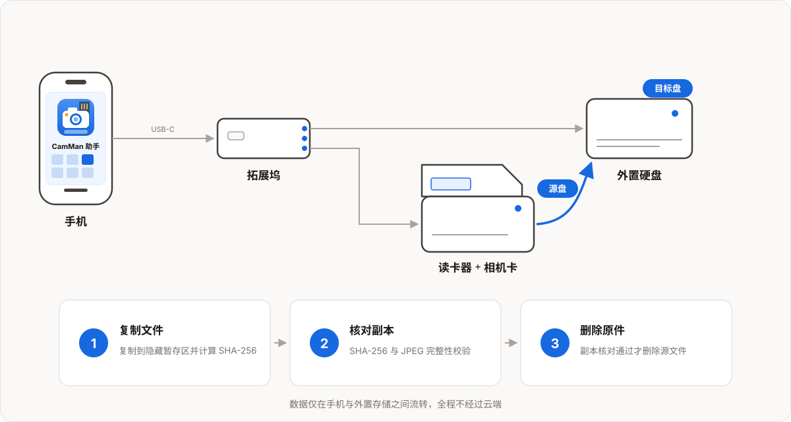

# 使用场景

不管你是喜欢摄影的爱好者，还是以摄影谋生的专业人士，在你每次拍完照片后，第一件事情应该就是考虑如何把卡的相片导出来，第二件事情应该是考虑如何查看刚才导出来的相片。

以前你要么拿着笔记本出去，要么购买类似大嘴盘之类的带导卡功能的移动硬盘，要么带上足够多的卡。这些解决方案通常价格不菲，功能单一，部分还要购买专用硬件，并没有从摄影爱好者和摄影师的角度，去设计一个真正合适的解决方案。

我也是一个摄影爱好者，上面这个问题也同样困扰了我多年。因此我开发了 CamMan 助手 App 来解决上面的问题。

# 技术原理

利用手机 + 拓展坞连接外接存储设备，然后通过 CamMan 助手 App 控制外接存储设备的读写，以实现相片的导出和写入。

从相机卡导出到外置硬盘，本质是一次「复制 + 核对 + 删除」：

1. **复制文件**：文件复制到目标盘上的隐藏暂存区，同时计算源文件的 SHA-256 摘要；可开启省电模式降低发热与耗电。
2. **核对副本**：复制完成后回读暂存文件做三重校验——核对文件字节数、比对源与目标的 SHA-256 摘要，并对 JPEG 做专项完整性扫描（能识别传输中截断、未写完的 JPEG）。全部通过后文件才从暂存区原子转正，校验结果先写入持久日志，之后才删除相机卡上的源文件；照片库上的原件在成功导出后移除需 iOS 系统确认，移除后可在“最近删除”中恢复。
3. **异常自动重传**：复制或校验过程中遇到瞬时读写错误（如 USB-C 瞬断、接触不良），会按约 1s → 2s → 4s 的节奏自动退避重试，最多 3 次，避免多个文件同时重试再次挤爆总线；重试仍失败的文件与同名冲突会列进结果报告，在结果报告页面即可启动重传或跳过。
4. **导出报告**：完成后显示导出报告，列出因同名、或其他原因导致的未导出文件供你确认，确认无误可选择重传或跳过。

# 批量导出

**功能介绍**

把相机卡或系统图库里的文件批量导出到外置硬盘或 U 盘。支持批量排队依次处理、并发数调节、省电模式，导出结束生成结果报告：成功、失败与同名冲突一目了然，失败的文件可以直接在结果报告页启动重传。

**操作介绍**

1. 用拓展坞把相机卡（读卡器）和外置存储同时接到 iPhone / iPad。
2. 在「导出素材」页选择源盘或系统图库与目标盘，需要连续处理多张卡时，把它们都加入源盘队列。
3. 按需调整并发数、开关省电模式，点击「开始导出」。
4. 导出完成后查看结果报告，失败的文件在报告页启动重传，同名冲突可逐个对比后覆盖或跳过。

# 浏览媒体

**功能介绍**

以照片墙形式浏览外置存储和相机卡中的照片与视频：缩略图网格快速总览、点开即看全屏大图、左右滑动连播。支持星级评分与 EXIF 信息查看，评分结果存储在卡上，可以使用 Mac 版的 CamMan 助手 App（暂未发布)通过电脑进行读取。

**专为摄影打造的功能**

1. 同名 JPG / RAW 自动配对成一组，默认显示 JPG、隐藏成对的 RAW，一键切换 RAW 视图即可优先查看 RAW 底片，挑片时同一张照片不会重复出现；该功能适合那些同时拍摄 JPG 和 RAW 的摄影师。
2. 照片全屏界面支持间隔 1s 的连续播放，在浏览大量连拍图片时，摄影师再也不那么费手了。
3. 视频播放支持倍速播放，方便摄影师快速浏览。

**操作介绍**

1. 在「浏览」页选择已连接的存储设备或文件夹。
2. 在照片墙中点按任意一张进入全屏。
3. 全屏中左右滑动切换，点击星标即可评分，也可以查看拍摄时间、光圈快门等 EXIF 信息。
4. 按文件类型筛选（照片 / RAW / 视频），快速定位要找的素材。

# 发送媒体

**功能介绍**

把外置存储中的素材直接发送出去：可以导入系统相册按拍摄时间整理入库，也可以通过隔空投送、微信、网盘等任意分享渠道发给他人或另一台设备。

**专为摄影打造**

1. RAW 文件会自动转换为 JPEG 发送，对方无需专用软件即可直接查看。
2. JPEG 和视频会按原格式进行发送，不压缩降低画质。

**操作介绍**

1. 在「浏览」页进入目标文件夹，多选需要发送的照片或视频。
2. 点击分享按钮，在分享面板中选择隔空投送、微信、网盘等方式，发送给其他设备或联系人。

# 拍摄参考

**功能介绍**

建立随身携带的拍摄参考资料库：从照片 App、文件 App 或指定网页导入参考图，按构图、光线、色彩、地点、风格打标签分类。外拍时按标签快速筛选，对照参考图取景复刻。

**操作介绍**

1. 在「拍摄参考」页点击导入，从照片 App、文件 App 选择图片，或粘贴网页地址批量抓取。
2. 为参考图添加标签（构图、光线、色彩、地点、风格），也可以按地点组织成目的地合集。
